# 🚕 Ride Fare Price Prediction — Dynamic Pricing ML System

[](https://github.com/narendrakalam2001/ride-fare-price-prediction-mlops/actions)
[](https://python.org)
[](https://scikit-learn.org)
[](https://fastapi.tiangolo.com)
[](https://streamlit.io)
[](https://lightgbm.readthedocs.io)
[](https://docker.com)
[](https://mlflow.org)
[](tests/)
[](LICENSE)

> **Domain:** Mobility / Ride-Hailing
> **Problem:** Regression — predict continuous fare amount ($) for a single trip from pickup/dropoff coordinates and time
> **Dataset:** [NYC Taxi Fare Prediction (Kaggle)](https://www.kaggle.com/competitions/new-york-city-taxi-fare-prediction) — 55,423,856 rows · pickup/dropoff GPS · passenger count · timestamp
> **Industry Context:** Uber · Ola · Rapido — fare prediction models power dynamic pricing, surge calculation, and driver payout estimation in production ride-hailing platforms

---

## 💡 Why This Project Matters

Ride-hailing platforms never expose a raw regression number to a rider — the ML prediction is one input into a larger pricing decision layer: hard sanity clamps, a fare-band for display, a surge/airport flag consumed by downstream systems, and a calibrated interval that says how much to trust the point estimate. This project reproduces that exact flow end-to-end, not just the model:

- **14 regressors + a neural network** are tuned and compared with `RandomizedSearchCV`, not just one model picked in isolation
- A **Pricing Engine** wraps every prediction in fare bands (`LOW`/`MEDIUM`/`HIGH`/`PREMIUM`) and business flags (`AIRPORT_FLAT_CANDIDATE`, `SURGE_ELIGIBLE`) — mirroring how NYC's flat-fare airport routes and rush-hour congestion pricing actually work
- **Residual/conformal calibration** (isotonic regression on |residual| vs prediction) produces genuine **90% prediction intervals** — the regression-native adaptation of probability calibration, since there's no probability to calibrate in a regression problem
- Every model promotion goes through a **3-gate Champion-Challenger** check — a new model only replaces production if it demonstrably beats the champion on RMSE, clears an R² floor, and doesn't overfit
- **Cost-sensitive business evaluation** translates prediction error into **$ revenue loss vs rider-trust cost** — the way a pricing team, not a data scientist, would judge the model

This is what separates a Kaggle notebook from a system a ride-hailing platform could actually deploy.

---

## 🏆 Champion Model Results

Real results from the final production-scale training run — LightGBM refit on **33.3M rows** (60% of the full 55M-row Kaggle dataset) after model selection confirmed LightGBM as the winner across 15 candidates:

| Metric | Score |
|---|---|
| **Champion Model** | `LightGBM` |
| **Test RMSE** | `$3.8067` |
| **Test MAE** | `$1.9381` |
| **Test MAPE** | `19.02%` |
| **Test R²** | `0.8419` |
| **Within ±15% accuracy** | `53.36%` |
| **Train-test generalization gap** | `< 0.01` (excellent — no overfitting) |
| **Rows trained on (final model)** | `20,531,990` (train-fit split of 33.3M rows) |
| **Total dataset rows available** | `55,423,856` |
| **Calibrated interval coverage** | `90.0%` empirical (target: 90%) |
| **Hyperparameter search** | `num_leaves=63, n_estimators=400, max_depth=12, learning_rate=0.1` |

---

## 🔗 Live Links

| Service | URL |
|---|---|
| 🚀 **FastAPI (Swagger UI)** | [https://ride-fare-price-prediction-mlops.onrender.com/docs](https://ride-fare-price-prediction-mlops.onrender.com/docs) |
| 📊 **Monitoring Dashboard** | [https://ride-fare-price-prediction-mlops.streamlit.app](https://ride-fare-price-prediction-mlops.streamlit.app) |
| 📓 **EDA Notebook** | [notebooks/ride_fare_price_prediction_eda.ipynb](notebooks/ride_fare_price_prediction_eda.ipynb) |

> ⚠️ Render free tier: first request may take 30–60 seconds (cold start).

---

## 🏗️ System Architecture

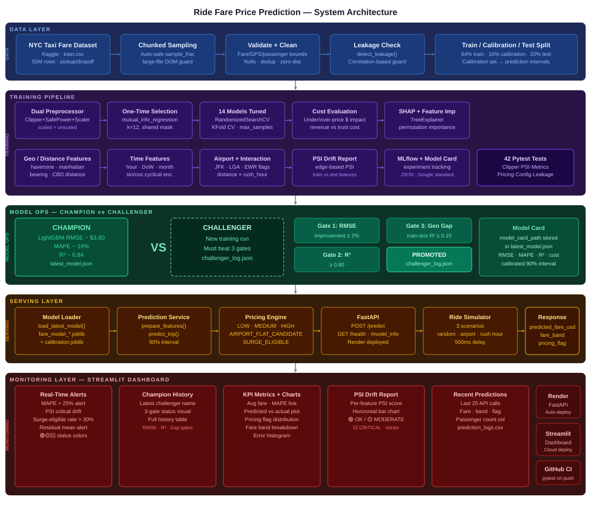

```
╔══════════════════════════════════════════════════════════════════════════════════╗
║           RIDE FARE PRICE PREDICTION — 5-LAYER PRODUCTION SYSTEM                 ║
╠══════════════════════════════════════════════════════════════════════════════════╣
║                                                                                  ║
║  ┌─────────────────────────────── DATA LAYER ──────────────────────────────┐     ║
║  │  NYC Taxi CSV → Chunked Sampling → Validate + Clean → Leakage Check     │     ║
║  │  55.4M rows · GPS + fare + timestamp · 64/16/20% train/cal/test split   │     ║
║  └───────────────────────────────────┬─────────────────────────────────────┘     ║
║                                      ▼                                           ║
║  ┌─────────────────────────── TRAINING PIPELINE ───────────────────────────┐     ║
║  │                                                                         │     ║
║  │  ┌──────────────────┐    ┌───────────────┐    ┌──────────────────────┐  │     ║
║  │  │  Dual Preproc.   │    │  14 Models    │    │  Evaluation          │  │     ║
║  │  │  Clipper+SafePwr │───▶│  + NeuralNet  │───▶│  RMSE·MAE·MAPE·R²   │  │     ║
║  │  │  scaled+unscaled │    │  RandomizedCV │    │  Cost eval · SHAP    │  │     ║
║  │  └──────────────────┘    └───────────────┘    └──────────────────────┘  │     ║
║  │                                                                         │     ║
║  │  One-time mutual_info feature selection (shared mask, not per-fold)     │     ║
║  │  Geo/time/interaction features · haversine · bearing · cyclical enc.    │     ║
║  │                                                                         │     ║
║  │  CHAMPION → LightGBM  RMSE=$3.8067  MAE=$1.94  R²=0.8419                │     ║
║  └───────────────────────────────────┬─────────────────────────────────────┘     ║
║                                      ▼                                           ║
║  ┌──────────────────────── CHAMPION-CHALLENGER ────────────────────────────┐     ║
║  │                                                                         │     ║
║  │  Gate 1: RMSE improvement       ≥ 2%     →  ✅ PASS / ❌ FAIL          │     ║
║  │  Gate 2: Test R²                ≥ 0.80   →  ✅ PASS / ❌ FAIL          │     ║
║  │  Gate 3: Train-test R² gap      ≤ 0.15   →  ✅ PASS / ❌ FAIL          │     ║
║  │                                                                         │     ║
║  │  ALL gates pass → PROMOTED (latest_model.json updated)                  │     ║
║  │  ANY gate fails → REJECTED (champion retained, result logged)           │     ║
║  └───────────────────────────────────┬─────────────────────────────────────┘     ║
║                                      ▼                                           ║
║  ┌──────────────────────────── SERVING LAYER ──────────────────────────────┐     ║
║  │                                                                         │     ║
║  │  Model Loader → Prediction Service → Pricing Engine → FastAPI           │     ║
║  │                                                                         │     ║
║  │  POST /predict     → trip GPS+time → fare + band + flag + 90% interval  │     ║
║  │  GET  /health       → API health check (→ {status, model_loaded})       │     ║
║  │  GET  /model_info   → champion registry (→ model name, card path)       │     ║
║  │                                                                         │     ║
║  │  Pricing Engine:  predicted $ → clamp → fare band → business flag       │     ║
║  │    LOW / MEDIUM / HIGH / PREMIUM · AIRPORT_FLAT_CANDIDATE · SURGE       │     ║
║  └───────────────────────────────────┬─────────────────────────────────────┘     ║
║                                      ▼                                           ║
║  ┌─────────────────── MONITORING LAYER — STREAMLIT DASHBOARD ──────────────┐     ║
║  │                                                                         │     ║
║  │  Section 1: Real-Time Alerts    → MAPE spike · PSI drift · surge rate   │     ║
║  │  Section 2: Champion-Challenger → decision · 3-gate status · history    │     ║
║  │  Section 3: KPIs + Charts       → RMSE/MAPE · predicted vs actual       │     ║
║  │  Section 4: PSI Drift           → per-feature PSI · colour-coded bar    │     ║
║  │  Section 5: Recent Predictions  → last 20 · fare · band · flag          │     ║
║  │  Sidebar:   Live Fare Predict   → enter trip → instant fare estimate    │     ║
║  │                                                                         │     ║
║  │  Simulator: 3 scenarios (random · airport run · rush hour) → /predict   │     ║
║  └─────────────────────────────────────────────────────────────────────────┘     ║
╚══════════════════════════════════════════════════════════════════════════════════╝
```

---

## 📸 Dashboard Screenshots

### 🖥️ Full Dashboard UI

Real-time fare monitoring dashboard — live sidebar fare prediction · Champion-Challenger system · KPI cards · PSI drift · prediction audit log.

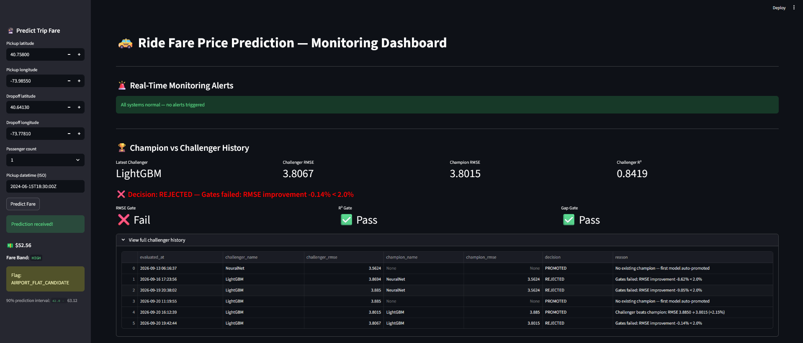

---

### 📊 Model Performance KPIs

RMSE/MAPE live tiles, predicted-vs-actual scatter, error distribution, and pricing-flag breakdown — the model's real-time health at a glance.

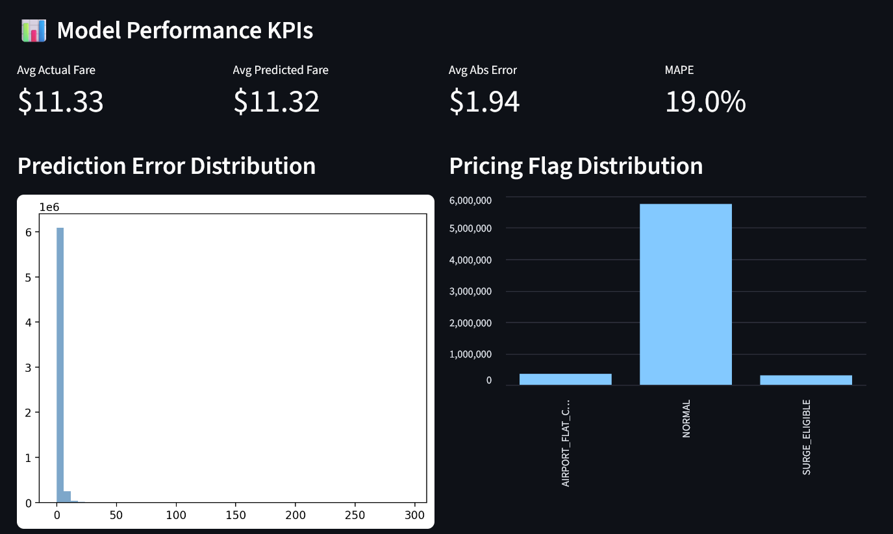

---

### 💵 Fare Statistics

Average actual vs predicted fare, average absolute error, and MAPE computed live from the monitor scores generated on every training run.

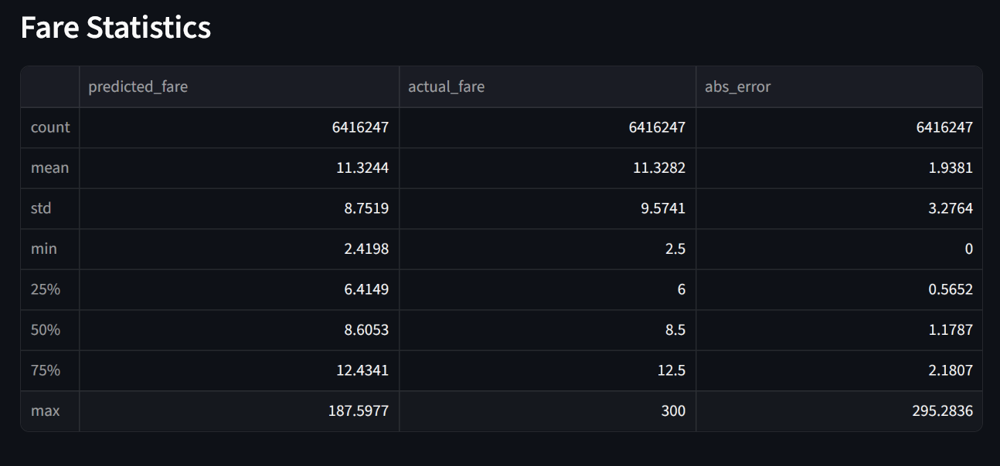

---

### 📈 Predicted vs Actual Fare

Scatter of predicted fare against actual fare on a held-out sample — points hugging the diagonal indicate low bias across the fare range.

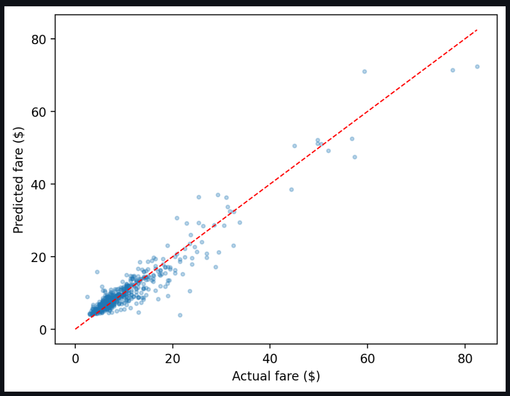

---

### 📉 Feature Drift Report (PSI)

Per-feature Population Stability Index between train and test distributions — colour-coded 🟢 stable / 🟡 moderate / 🔴 critical (retrain trigger).


---

### 📊 Feature PSI Drift Scores

Horizontal bar chart of the top-10 features by PSI score, with moderate/critical threshold lines overlaid for quick visual triage.

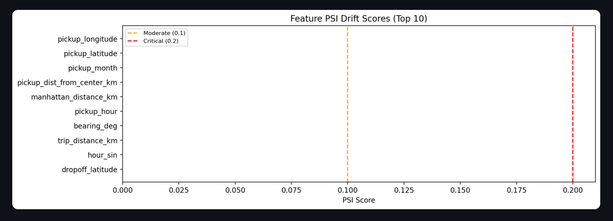

---

### 📋 Recent Predictions Log

Live audit trail of the last 20 API predictions — fare, band, and pricing flag per call, written directly from `logs/prediction_logs.csv`.

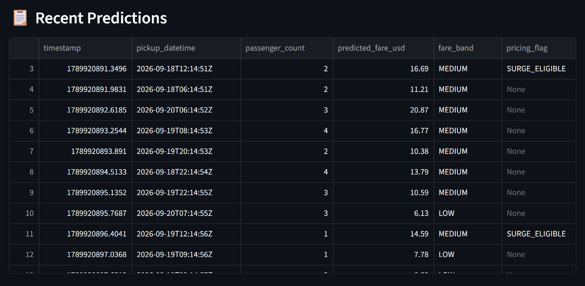

---

## 📊 Training Reports

| All-Models Comparison | Champion vs Challenger |
|---|---|
| 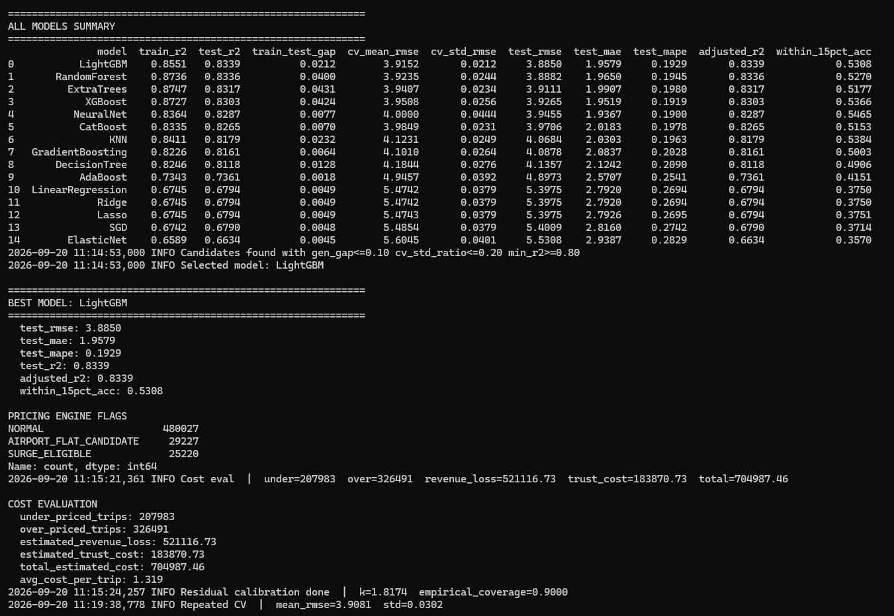 | 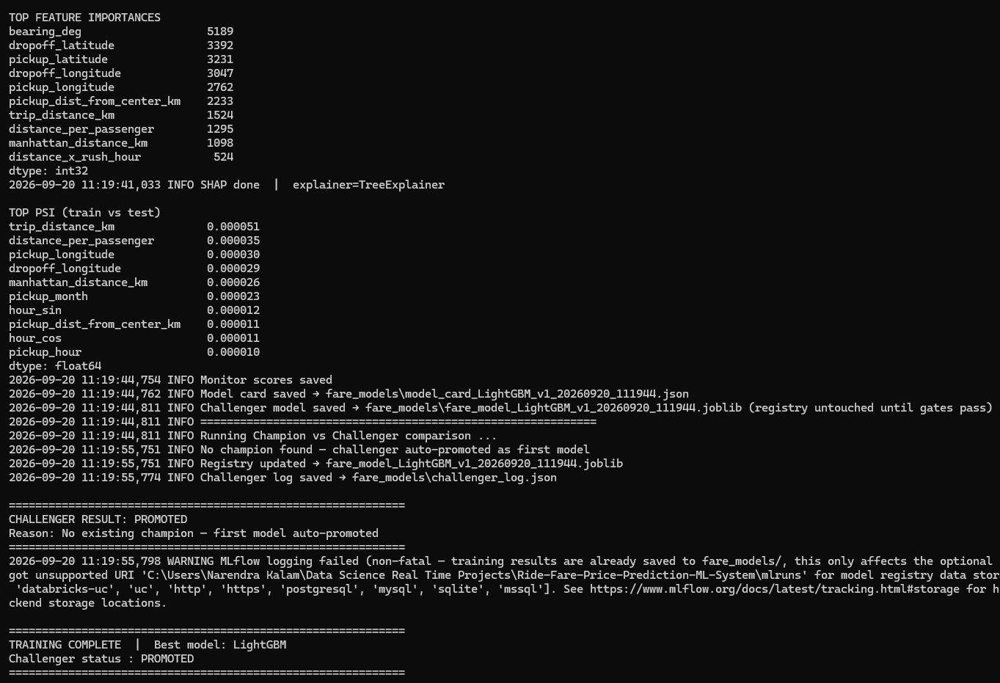 |

| Predicted vs Actual (Training Run) | Ride Simulator Output |
|---|---|
| 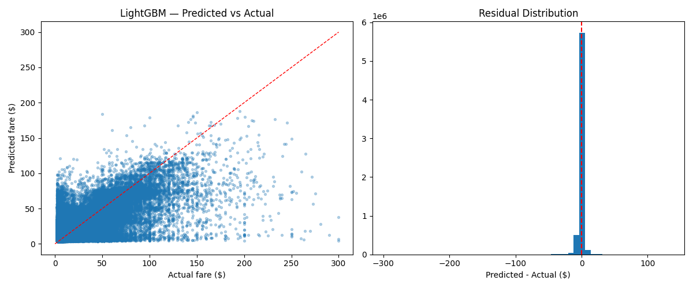 | 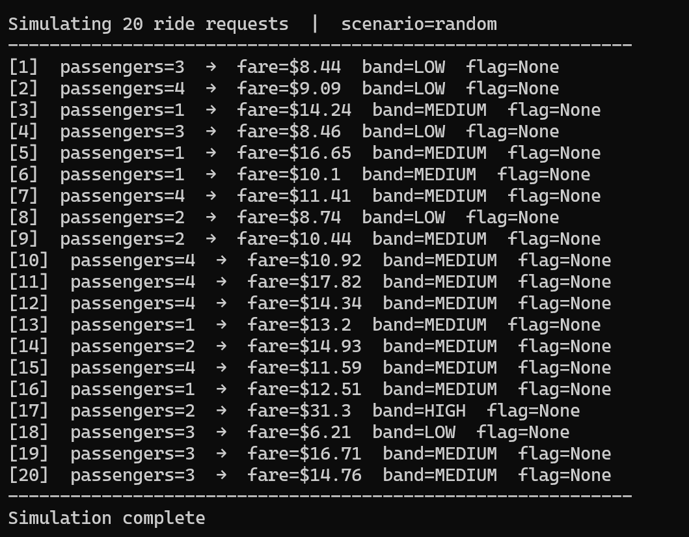 |

| Test Coverage |
|---|
| 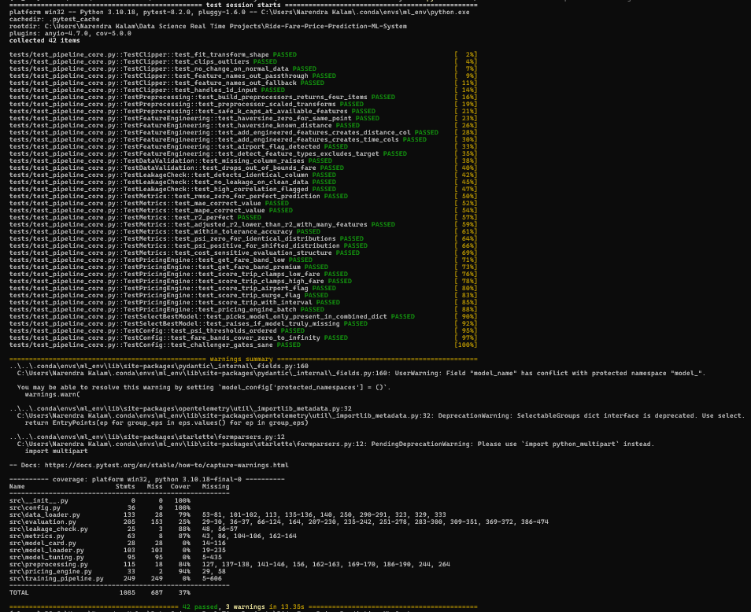 |

### 📐 Scaling Validation — Diminishing Returns Confirmed

The champion was retrained at two different data scales using `scripts/train_final_model.py` (single-model refit, no re-search) to check whether more data was worth the extra compute:

| SAMPLE_FRAC=0.4 (~22M rows) | SAMPLE_FRAC=0.6 (~33M rows) |
|---|---|
| 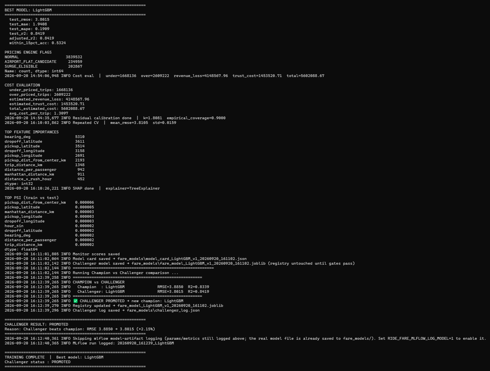 | 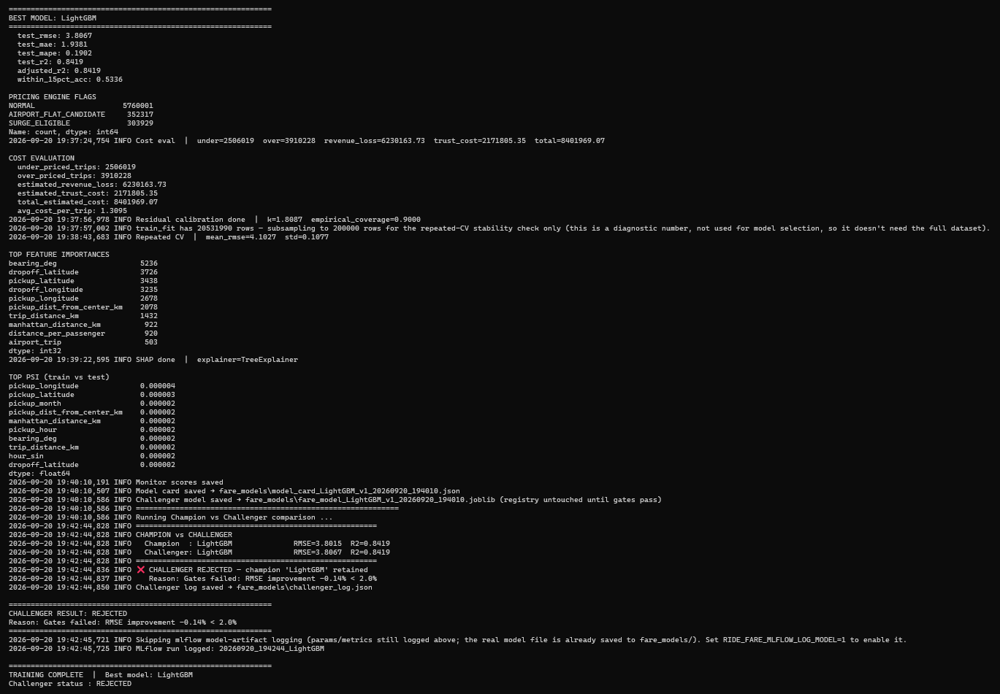 |

**Result:** 11M additional rows (50% more data) moved test R² from `0.8419` to `0.8419` — no measurable improvement, and RMSE actually moved 0.14% in the wrong direction (well inside noise). The 0.6-scale challenger was correctly **REJECTED** by the Champion-Challenger gates. This is real evidence the model had already converged at the 22M-row scale — see [Champion vs Challenger](#-champion-vs-challenger--3-gate-promotion) below for the full gate log.

---

## 🎬 System Demo

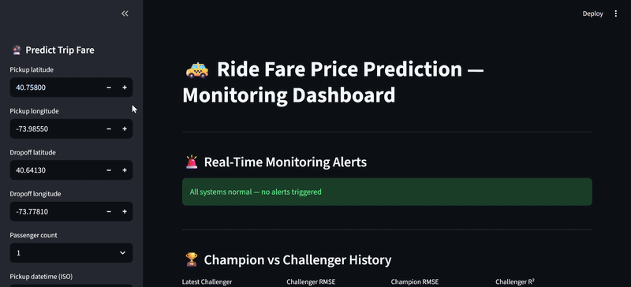

---

## 📁 Project Structure

```
Ride-Fare-Price-Prediction-ML-System/
│
├── src/                                    # Core ML system
│   ├── config.py                           # All constants — geo bounds, fare bounds, gates, env-var overrides
│   ├── data_loader.py                      # Chunked/sampled loading · validation · feature engineering · dtype opt.
│   ├── preprocessing.py                    # Clipper · SafePowerTransformer · dual ColumnTransformer
│   ├── model_tuning.py                     # 14 model grids · FixedIndexSelector · RandomizedSearchCV tuning
│   ├── leakage_check.py                    # Correlation-based leakage guard
│   ├── metrics.py                          # RMSE·MAE·MAPE·R²·PSI·cost-sensitive business evaluation
│   ├── evaluation.py                       # Model selection · calibration · SHAP · MLflow logging
│   ├── model_card.py                       # Google Model Cards standard — JSON builder/saver/loader
│   ├── model_loader.py                     # Champion-Challenger 3-gate registry system
│   ├── pricing_engine.py                   # Fare bands + business rule flags (airport/surge)
│   └── training_pipeline.py               # End-to-end + single-model "final" refit pipeline
│
├── serving/
│   └── fare_api.py                         # FastAPI: /predict · /health · /model_info
│
├── services/
│   └── prediction_service.py              # Feature prep → inference → pricing engine
│
├── monitoring/
│   └── monitoring_dashboard.py            # Streamlit: 5-section monitoring dashboard
│
├── simulation/
│   └── ride_simulator.py                  # 3-scenario ride request generator (random · airport · rush hour)
│
├── tests/
│   └── test_pipeline_core.py              # 42 pytest unit tests — all passing
│
├── scripts/
│   ├── train_model.py                      # python scripts/train_model.py — full 14-model comparison
│   ├── train_final_model.py               # python scripts/train_final_model.py — single-model refit at scale
│   ├── generate_sample_data.py            # Synthetic NYC-taxi-schema data generator
│   ├── run_api.py                          # python scripts/run_api.py
│   ├── run_dashboard.py                    # python scripts/run_dashboard.py
│   └── run_simulation.py                  # python scripts/run_simulation.py
│
├── notebooks/
│   ├── ride_fare_price_prediction_eda.ipynb   # Professional EDA — 26 steps
│   └── ride_fare_price_prediction_eda.html    # Rendered HTML export
│
├── data/
│   ├── sample_nyc_taxi_fare_dataset.csv   # Representative sample — quick testing without the 55M-row download
│   └── sample_dataset_info.txt            # Sample dataset notes + real dataset download instructions
│
├── fare_models/                           # Model artifacts — JSON + joblib pushed to GitHub
│   ├── latest_model.json                  # Champion model registry
│   ├── challenger_log.json                # Full Champion-Challenger comparison history
│   ├── model_card_lightgbm_v*.json        # Google Model Card JSON
│   ├── model_experiment_results.csv       # All-15-models comparison table
│   └── feature_drift_report.csv           # PSI drift per feature
│
├── docs/
│   ├── architecture/
│   │   └── system_architecture.svg         # 5-layer system architecture diagram
│   ├── plots/
│   │   └── predicted_vs_actual.png         # Predicted vs actual scatter + residual histogram
│   ├── screenshots/
│   │   ├── dashboard_full_ui.png           # Full Streamlit dashboard UI
│   │   ├── model_performance_kpis.png      # KPI tiles + charts
│   │   ├── fare_statistics.png             # Avg fare / MAPE / abs error tiles
│   │   ├── predicted_vs_actual_fare.png    # Dashboard scatter plot
│   │   ├── feature_drift_report(psi).png   # PSI drift table
│   │   ├── feature_psi_drift_scores.png    # PSI drift bar chart
│   │   └── recent_predictions.png          # Recent predictions audit log
│   ├── reports/
│   │   ├── training_model_summary.png      # All-models comparison terminal output
│   │   ├── challenger_evaluation.png       # Champion-Challenger gate results
│   │   ├── simulation.png                  # Simulation run terminal output
│   │   ├── test_coverage.png               # pytest 42/42 coverage report
│   │   ├── best_model_with_SAMPLE_FRAC_0.4.png  # Final-model run at 22M rows
│   │   └── best_model_with_SAMPLE_FRAC_0.6.png  # Final-model run at 33M rows
│   └── gifs/
│       └── system_demo.gif                 # End-to-end system demo
│
├── logs/
│   └── prediction_logs.csv                # API prediction audit log (auto-generated)
│
├── Dockerfile                             # FastAPI production image
├── Dockerfile.dashboard                   # Streamlit dashboard container
├── docker-compose.yml                     # API + Dashboard (ports 8000 + 8501)
├── .github/workflows/ci.yml              # GitHub Actions — pytest on every push
├── .gitignore
├── .dockerignore
├── LICENSE                                # MIT License
├── README.md                              # This file
├── render.yaml                            # Render.com deployment config
├── requirements.txt                       # All dependencies (training)
├── requirements_api.txt                   # Trimmed dependencies (API deploy)
├── requirements_dashboard.txt             # Trimmed dependencies (dashboard deploy)
├── runtime.txt                            # Python 3.10.13
└── verify_mlflow_fix.py                  # Fast (~1s) standalone MLflow sanity check
```

---

## 🚀 Quickstart

### 1. Clone & Install

```bash
git clone https://github.com/narendrakalam2001/ride-fare-price-prediction-mlops.git
cd ride-fare-price-prediction-mlops
pip install -r requirements.txt
```

### 2. Get the Dataset

```
data/
├── sample_nyc_taxi_fare_dataset.csv   # Representative sample — works out of the box
└── sample_dataset_info.txt            # Notes + how to get the real 55M-row Kaggle file

 For portfolio-grade numbers, download the full dataset from Kaggle and place it as
 data/train.csv (or point RIDE_FARE_DATA_PATH at it) — see sample_dataset_info.txt.
```

### 3. Train — Full Model Comparison

```bash
python scripts/train_model.py
```

Expected output (auto-scales the search budget on large datasets automatically):
```
INFO  Data validation passed  | shape=(32081238, 7)  fare_mean=11.33
INFO  Tuning 6 models with a fixed 12-feature mask (selected once, reused for every fold)
INFO  Tuning: LightGBM
INFO  LightGBM best params: {...}  best CV RMSE=3.9152
INFO  Selected model: LightGBM
INFO  ✅ CHALLENGER PROMOTED → new champion: LightGBM
TRAINING COMPLETE  |  Best model: LightGBM
```

### 4. Train — Final Model At Scale (Optional)

Once a comparison run tells you which model wins, refit *only* that model on more data — no re-search, dramatically faster:

```bash
$env:RIDE_FARE_SAMPLE_FRAC = "0.4"     # PowerShell; bash: export RIDE_FARE_SAMPLE_FRAC=0.4
python scripts/train_final_model.py
```

### 5. Start API

```bash
python scripts/run_api.py
# API:  http://localhost:8000
# Docs: http://localhost:8000/docs
```

### 6. Start Dashboard

```bash
python scripts/run_dashboard.py
# Dashboard: http://localhost:8501
```

### 7. Run Simulation

```bash
python scripts/run_simulation.py
```

### 8. Run Tests

```bash
pytest tests/ -v --cov=src --cov-report=term-missing
# 42 collected · 42 passed · 0 failed
```

### 9. Verify MLflow (fast, ~1 second — no need to run full training just to check this)

```bash
python verify_mlflow_fix.py
```

---

## 🐳 Docker

```bash
# Start everything
docker compose up --build

# API only
docker compose up api

# Dashboard only
docker compose up dashboard

# Stop
docker compose down
```

| Service | URL |
|---|---|
| FastAPI + Swagger | `http://localhost:8000/docs` |
| Streamlit Dashboard | `http://localhost:8501` |

---

## 🌐 API Reference

### POST /predict — Single Trip Fare Prediction

```bash
curl -X POST "http://localhost:8000/predict" \
  -H "Content-Type: application/json" \
  -d '{
    "pickup_datetime": "2024-06-15T18:30:00Z",
    "pickup_longitude": -73.9855,
    "pickup_latitude": 40.7580,
    "dropoff_longitude": -73.7781,
    "dropoff_latitude": 40.6413,
    "passenger_count": 2
  }'
```

**Response:**
```json
{
  "predicted_fare_usd": 93.55,
  "fare_band": "PREMIUM",
  "pricing_flag": "AIRPORT_FLAT_CANDIDATE",
  "prediction_interval_90": [80.24, 103.04],
  "latency_seconds": 0.037
}
```

### GET /health

```json
{"status": "running", "model_loaded": true}
```

### GET /model_info

```json
{
  "model_name": "fare_model_LightGBM_v1_20260920_194010.joblib",
  "model_card_path": "fare_models/model_card_LightGBM_v1_20260920_194010.json",
  "calibration_name": "calibration_LightGBM_v1.joblib"
}
```

---

## 📊 All 15 Models — Comparison Table

Real results from a full comparison run (1.7M-row train-fit set, before the final large-scale refit):

| Model | Test R² | Test RMSE | Test MAPE | Gen. Gap |
|---|---|---|---|---|
| **LightGBM** ⭐ | **0.8339** | **3.8850** | 19.29% | 0.0212 |
| RandomForest | 0.8336 | 3.8882 | 19.45% | 0.0400 |
| ExtraTrees | 0.8317 | 3.9111 | 19.80% | 0.0431 |
| XGBoost | 0.8303 | 3.9265 | 19.15% | 0.0424 |
| NeuralNet (MLP) | 0.8287 | 3.9455 | 19.00% | 0.0077 |
| CatBoost | 0.8265 | 3.9706 | 19.78% | 0.0070 |
| KNN | 0.8179 | 4.0684 | 19.63% | 0.0232 |
| GradientBoosting | 0.8161 | 4.0878 | 20.28% | 0.0064 |
| DecisionTree | 0.8118 | 4.1357 | 20.90% | 0.0128 |
| AdaBoost | 0.7361 | 4.8973 | 25.41% | 0.0018 |
| LinearRegression | 0.6794 | 5.3975 | 26.94% | 0.0049 |
| Ridge | 0.6794 | 5.3975 | 26.94% | 0.0049 |
| Lasso | 0.6794 | 5.3975 | 26.95% | 0.0049 |
| SGD | 0.6790 | 5.4009 | 27.42% | 0.0048 |
| ElasticNet | 0.6634 | 5.5308 | 28.29% | 0.0045 |

> LightGBM and the other gradient-boosted/tree ensembles cluster tightly around R²≈0.83, all clearly ahead of the linear family (R²≈0.68) — trip fare has real non-linear structure (distance × time-of-day interactions, airport flat-fare routes) that linear models can't capture. LightGBM's histogram-based splits made it both the most accurate *and* one of the fastest to tune.

---

## 🏆 Champion vs Challenger — 3-Gate Promotion

Every new training run is compared against the production champion using **3 promotion gates**:

| Gate | Condition | Rationale |
|---|---|---|
| RMSE Improvement | Challenger must beat champion by ≥ 2% (relative) | Meaningful accuracy gain only, not noise |
| R² Threshold | ≥ 0.80 | Minimum viable predictive power |
| Train-Test R² Gap | ≤ 0.15 | No overfitting to the training set |

**Real run — challenger promoted after scaling to more data:**

```
CHAMPION vs CHALLENGER
  Champion  : LightGBM              RMSE=3.8850  R2=0.8339
  Challenger: LightGBM              RMSE=3.8015  R2=0.8419
✅ CHALLENGER PROMOTED → new champion: LightGBM
Reason: Challenger beats champion: RMSE 3.8850 → 3.8015 (+2.15%)
```

**Real run — challenger rejected when more data stopped helping (see [Scaling Validation](#-scaling-validation--diminishing-returns-confirmed)):**

```
CHAMPION vs CHALLENGER
  Champion  : LightGBM              RMSE=3.8015  R2=0.8419
  Challenger: LightGBM              RMSE=3.8067  R2=0.8419
❌ CHALLENGER REJECTED — champion 'LightGBM' retained
Reason: Gates failed: RMSE improvement -0.14% < 2.0%
```

> **Why this matters:** the second run proves the gates aren't rubber-stamping every retrain — a genuinely worse (if only marginally) model gets correctly rejected, even though it was trained on 50% more data and "should" intuitively be better. This is exactly the discipline a production pricing system needs.

Results logged to `fare_models/challenger_log.json` and visible in the dashboard Section 2 with per-gate ✅/❌ status.

---

## 💰 Cost-Sensitive Business Evaluation

`src/metrics.cost_sensitive_evaluation()` translates prediction error into $ impact the way a ride-hailing pricing team would report it — not RMSE, dollars:

- **Under-pricing** (`pred < actual`) → direct **platform revenue loss**
- **Over-pricing** (`pred > actual`) → smaller **rider/driver trust** opportunity cost

Real numbers from the final champion evaluated on a 6.4M-row test set:

| Metric | Value |
|---|---|
| Under-priced trips | 2,506,019 |
| Over-priced trips | 3,910,228 |
| Estimated revenue loss | $6,230,163.73 |
| Estimated rider-trust cost | $2,171,805.35 |
| **Total estimated cost** | **$8,401,969.07** |
| Avg. cost per trip | **$1.31** |

---

## 🧠 Technical Standards

| Component | Implementation |
|---|---|
| **Champion Model** | LightGBM — histogram-based GBDT, `num_leaves=63, n_estimators=400, max_depth=12` |
| **Outlier Handling** | `Clipper` — IQR-based clipping with a degenerate-column safeguard (zero-inflated features no longer collapse to near-constant) |
| **Power Transform** | `SafePowerTransformer` — per-column Yeo-Johnson with automatic passthrough fallback if a column's optimizer fails |
| **Preprocessing** | Dual `ColumnTransformer` — scaled branch for linear/distance models, unscaled (clipped-only) branch for trees |
| **Feature Selection** | `mutual_info_regression`, computed **once** and shared across every model (not per CV fold) |
| **Hyperparameter Search** | `RandomizedSearchCV` — sequential (`n_jobs=1`) with each internally-parallel estimator using `n_jobs=-1`, avoiding nested-parallelism memory issues |
| **Row Subsampling** | `max_samples=0.3` on RandomForest/ExtraTrees — per-tree row subsampling for large-N training speed |
| **Calibration** | Residual/conformal — isotonic regression on \|residual\| vs prediction → calibrated 90% intervals |
| **Explainability** | SHAP `TreeExplainer` + permutation importance fallback |
| **Leakage Detection** | Correlation-based guard — exact-match and near-perfect-correlation checks before training |
| **Drift Monitoring** | Edge-based PSI, computed per feature between train and test |
| **Model Card** | Google Model Cards standard — JSON with metrics, calibration, cost evaluation, feature importances |
| **Experiment Tracking** | MLflow — file-store backend (Windows-path-safe URI construction), params + metrics logged every run |
| **Champion-Challenger** | 3-gate: RMSE improvement ≥ 2% · R² ≥ 0.80 · train-test gap ≤ 0.15 |
| **Memory Safety** | Auto dtype downcasting (float64→float32), explicit `del`+`gc.collect()` after each split, auto sample_frac on large files |
| **CI/CD** | GitHub Actions — pytest on every push |
| **Deployment** | Render.com (FastAPI) + Streamlit Cloud (Dashboard) |

---

## 🧪 Test Coverage

```
42 tests collected across 9 test classes:

  TestClipper           (6) — fit/transform shape · clips outliers · no-op on normal data ·
                               feature names passthrough/fallback · handles 1D input
  TestPreprocessing      (3) — build_preprocessors returns 4 items · scaled transform works ·
                               safe_k caps at available features
  TestFeatureEngineering (6) — haversine zero/known distance · engineered distance/time columns ·
                               airport flag detection · feature type detection excludes target
  TestDataValidation     (2) — missing column raises · drops out-of-bounds fare
  TestLeakageCheck       (3) — detects identical column · no leakage on clean data · high correlation flagged
  TestMetrics            (9) — RMSE/MAE/MAPE/R² correctness · adjusted R² · within-tolerance accuracy ·
                               PSI zero/positive · cost-sensitive evaluation structure
  TestPricingEngine      (8) — fare band boundaries · clamping · airport/surge flags · prediction interval ·
                               batch pricing engine
  TestSelectBestModel    (2) — picks model only present in combined dict · raises if model truly missing
  TestConfig             (3) — PSI thresholds ordered · fare bands cover 0→∞ · challenger gates sane

Result: 42 passed · 0 failed
```


---

## 📈 Monitoring Dashboard — 5 Sections

| Section | What it shows |
|---|---|
| **1. Real-Time Alerts** | MAPE > 25% alert · PSI critical drift · surge-eligible rate > 30% |
| **2. Champion-Challenger** | Latest decision badge · 3-gate pass/fail status · full history table |
| **3. KPIs + Charts** | Avg fare · MAPE · predicted-vs-actual scatter · error histogram · pricing flag distribution |
| **4. PSI Drift** | Per-feature PSI score · colour-coded bar (🟢 stable / 🟡 moderate / 🔴 critical) |
| **5. Recent Predictions** | Last 20 API calls · fare · band · pricing flag |
| **Sidebar** | Live fare prediction — enter trip details → instant fare + band + flag + 90% interval |

---

## 🛡️ Limitations & Notes

- The Kaggle NYC Taxi Fare dataset spans 2009–2015; fare structures (base fare, per-mile rate) have changed since — treat this as a methodology demonstration, not a live 2026 NYC fare estimator without recalibration
- Trained on a 55M-row static dataset, not a live feed — a production deployment would need continuous retraining against current trip data and PSI-triggered refresh, which this system's monitoring layer is designed to support but doesn't automate end-to-end
- Airport/surge flags are rule-based heuristics layered on top of the ML prediction (matching how real platforms combine model output with business rules), not independently modeled — they have not been validated against actual NYC flat-fare/surge policy documents
- `within_15pct_accuracy` (53.4%) means roughly half of predictions land within 15% of the true fare — acceptable for a display estimate with a calibrated interval attached, but this system does not claim precision suitable for final billing without a human-in-the-loop or stricter downstream validation
- Scaling validation (22M vs 33M rows, see above) showed the model had already converged — further data collection would need genuinely new signal (e.g. live traffic, weather, event calendars) rather than more historical rows to meaningfully improve past R²≈0.84

---

## 👨‍💻 About

**Narendra Kalam** — MSc Computer Science (Gold Medalist — NASSCOM, Full Stack Data Science + AI)

> Building 20+ industry-level, end-to-end ML systems across all domains.

[](https://www.linkedin.com/in/narendra-kalam/)
[](https://www.kaggle.com/narendrakalam)
[](https://narendrakalam2001.github.io/)
[](mailto:kalamnarendra2001@gmail.com)

### Portfolio Projects

| # | Project | Domain | Champion Model | Key Metric |
|---|---|---|---|---|
| 1 | Credit Card Fraud Detection | BFSI / Fintech | ExtraTrees | F1 = 0.8962 · 284K transactions |
| 2 | Credit Risk Prediction | BFSI / Lending | LightGBM | F1 = 0.9741 · ROC-AUC = 0.9991 |
| 3 | Customer Churn Prediction | Telecom / BFSI | CatBoost | F1 = 0.634 · Recall = 0.7312 |
| 4 | House Price Prediction | Real Estate | CatBoost | RMSE = $20,128 · R² = 0.9053 |
| 5 | Store Sales Forecasting | Retail / Supply Chain | LightGBM (Ensemble) | RMSLE = 0.3739 · R² = 0.9761 |
| 6 | Energy Demand Forecasting | Energy / Utilities | ElasticNet | RMSE = 712.04 MW · R² = 0.9759 |
| 7 | Stock Price & Risk Forecasting | Fintech / Capital Markets | Ridge | DirAcc = 53.44% · Sharpe = 0.80 |
| 8 | Resume Screener AI | HR Tech | LightGBM | F1 = 0.7608 · Top-3 = 0.9416 |
| 9 | ABSA Sentiment Analysis | E-Commerce / Banking | RidgeClassifier | Macro-F1 = 0.6212 · ROC-AUC = 0.823 |
| 10 | Fake News Detector | Media Tech / Gov Tech | XGBoost | F1 = 0.9993 · ROC = 1.0000 |
| 11 | BC5CDR Clinical NER | Biomedical NLP | BioBERT | F1 = 0.8847 · Chemical F1 = 0.9239 |
| 12 | News Topic Modeling | Media Analytics | LDA (Gensim) | Cv = 0.6225 · Diversity = 0.92 |
| 13 | Chest X-Ray Diagnosis | Healthcare AI | DenseNet121 | Mean AUC = 0.7864 · 14 classes |
| 14 | Real-Time Object Detection | Computer Vision / Retail-Security | YOLOv8s | mAP50-95 = 0.5341 · 32 FPS |
| 15 | Face Emotion Recognition | EdTech / Retail CX | CNN-from-scratch | Macro-F1 = 0.5950 · 7 classes |
| 16 | Customer Segmentation Engine | E-Commerce / BFSI | DBSCAN (Unsupervised) | Silhouette = 0.4056 |
| 17 | Market Basket Analysis (Instacart) | Retail / Quick-Commerce | Apriori | 68,820 rules · mean lift = 15.66 |
| 18 | E-Commerce / OTT Recommender | E-Commerce / Streaming | Hybrid (SVD + Content) | NDCG@10 = 0.0407 · 4 candidates |
| 19 | Hospital Readmission Prediction | Healthcare / Hospital Ops | ExtraTrees | F1 = 0.2702 · ROC-AUC = 0.6513 |
| 20 | HR Policy Intelligence Chatbot | HR Tech / Enterprise GenAI | Gemini 3.6 Flash + RAG | 30/30 tests · guardrail threshold=0.35 |
| 21 | Employee Attrition Prediction | HR Tech / People Analytics | NeuralNet (MLP) | F1 = 0.3902 · ROC-AUC = 0.6698 |
| 22 | ANN From Scratch — MNIST Digit Recognizer | Deep Learning Fundamentals | From-scratch ANN | Test Acc = 0.9740 · Macro F1 = 0.9739 |
| 23 | Insurance Premium Prediction | Insurance / Actuarial ML | RandomForest | RMSLE = 1.1586 · 1.2M real policies |
| 24 | Health Insurance Cross-Sell | Insurance / BFSI | ExtraTrees | ROC-AUC = 0.8404 · 67.8% calls saved |
| 25 | **Ride Fare Price Prediction** | **Mobility / Ride-Hailing** | **LightGBM** | **RMSE = $3.81 · R² = 0.8419 · 55M rows** |

---

## 📚 References

- Kaggle — [New York City Taxi Fare Prediction](https://www.kaggle.com/competitions/new-york-city-taxi-fare-prediction)
- Ke et al. (2017) — [LightGBM: A Highly Efficient Gradient Boosting Decision Tree](https://papers.nips.cc/paper/6907-lightgbm-a-highly-efficient-gradient-boosting-decision-tree)
- Google Model Cards — [Model Cards for Model Reporting](https://arxiv.org/abs/1810.03993)
- Lundberg & Lee (2017) — [A Unified Approach to Interpreting Model Predictions (SHAP)](https://arxiv.org/abs/1705.07874)

---

## 📄 License

MIT License — see [LICENSE](LICENSE)